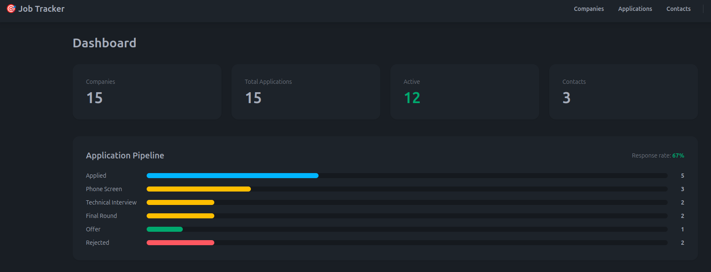

# Job Tracker — The Survivor

A Django application for tracking job applications across the full hiring pipeline.
Built as part of a live infrastructure demo: the app runs on a 3-node K3s cluster on
Hetzner Cloud, with automated backups to a remote storage box and full disaster recovery
— the entire cluster can be destroyed and rebuilt from scratch in under 15 minutes.

🔗 **Live demo:** [https://demo.jmarroyo.es](https://demo.jmarroyo.es) *(available during infrastructure demo)*  
🎛️ **Control panel:** [infrastructure-demo-control](https://github.com/juan-arroyo/infrastructure-demo-control)



---

## Stack

| Layer | Technology |
|---|---|
| Backend | Django 5 + Gunicorn |
| Database | PostgreSQL 16 |
| Frontend | HTMX + Tailwind CSS + DaisyUI |
| Reverse proxy | Nginx |
| Container runtime | Docker + Docker Compose (local) |
| Orchestration | K3s / Kubernetes (production) |
| CI/CD | GitHub Actions + Ansible |
| Backups | Hetzner Storage Box — automated daily cronjob |
| Registry | Docker Hub — `juanmnarroyo/job-tracker:v5` |

---

## Features

- Track job applications across 6 pipeline stages: Applied → Phone Screen → Technical Interview → Final Round → Offer → Rejected
- Manage companies, contacts, and interview rounds per application
- Dashboard with live pipeline breakdown and response rate
- Login/logout with Django authentication — all views protected
- Fixtures with 15 real Dutch and German tech companies (Booking.com, ASML, Adyen, Zalando, Hetzner...)

---

## Architecture

```
Local development:
Browser → Nginx :8000 → Gunicorn (Django) → PostgreSQL

Production (K3s on Hetzner):
Internet → Traefik (Ingress) → Service → Django Pod x2 replicas → PostgreSQL Pod
                ↑                                                        ↓
         cert-manager (SSL)                              Backup CronJob → Hetzner Storage Box
```

**Cluster layout:**

| Node | Role |
|---|---|
| k3s-server | Control plane + GitHub Actions self-hosted runner |
| k3s-agent-1 | Django replica 1 + PostgreSQL |
| k3s-agent-2 | Django replica 2 |

---

## Disaster Recovery

The cluster can be fully destroyed and rebuilt without data loss:

1. A Kubernetes CronJob runs daily `pg_dump` backups to a Hetzner Storage Box over SSH
2. The control panel ([infrastructure-demo-control](https://github.com/juan-arroyo/infrastructure-demo-control)) triggers cluster destruction and reprovisioning via Ansible
3. On rebuild, the provisioning playbook restores the latest backup before starting the app
4. The app is back online at `demo.jmarroyo.es` with all data intact — in under 15 minutes

---

## CI/CD Pipeline

Every `git push` to `main` triggers a GitHub Actions workflow:

1. The workflow connects to the self-hosted runner on `k3s-server`
2. An Ansible playbook applies the latest K3s manifests
3. Kubernetes performs a rolling update — zero downtime

> **Note:** Automated Docker image builds are planned as a next step.
> The current image is built manually and pushed to Docker Hub as `juanmnarroyo/job-tracker:v5`.

---

## Local Development

**Requirements:** Docker, Docker Compose

```bash
# Clone the repo
git clone https://github.com/juan-arroyo/job-tracker.git
cd job-tracker

# Start all services
docker compose up --build

# In a separate terminal — run migrations and load sample data
docker compose exec web python manage.py migrate
docker compose exec web python manage.py loaddata tracker/fixtures/initial_data.json
docker compose exec web python manage.py createsuperuser
```

Open `http://localhost:8000` and log in with the superuser credentials.

---

## Project Structure

```
job-tracker/
├── backend/                  # Django application
│   ├── config/
│   │   └── settings/
│   │       ├── base.py       # shared settings
│   │       ├── dev.py        # local development
│   │       └── k3s.py        # production (K3s + PostgreSQL)
│   └── tracker/              # main app — models, views, templates
│       ├── fixtures/         # sample data with real Dutch/German companies
│       └── templates/
├── manifests/                # Kubernetes manifests
│   ├── deployment.yaml       # Django — 2 replicas
│   ├── postgres-deployment.yaml
│   ├── ingress.yaml          # Traefik + SSL via cert-manager
│   └── backup-cronjob.yaml   # daily pg_dump to Hetzner Storage Box
├── ansible/                  # automation playbooks
│   ├── deploy.yml            # applies K3s manifests (triggered by GitHub Actions)
│   └── provision.yml         # full cluster provisioning from scratch
├── nginx/
│   └── nginx.conf            # reverse proxy config for local dev
└── docker-compose.yml
```

---

## Part of a Larger Demo

This repo is **The Survivor** — the app that gets destroyed and comes back.

The companion project [infrastructure-demo-control](https://github.com/juan-arroyo/infrastructure-demo-control)
is the control panel that orchestrates the entire lifecycle: provisioning, destroying, and
rebuilding the cluster via a web interface with real-time log streaming over WebSockets.

Together they demonstrate: Ansible · Kubernetes · CI/CD · Backup & Recovery · Django · Docker
